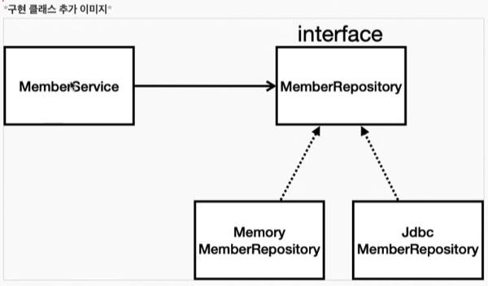

순수 JDBC
1. build.gradle 에 jdbc, H2 DB 라이블러리 추가
2. application.properties에 접속정보 입력(build.gradle에서 dependency동기화를 해주어야함)
3. spring2.4 이상버전은 `spring.datasource.username=sa`도 반드시 입력해주어야함
4. 상속 repository를 작성 후 springConfig.java에서 datasource 설정
 

테스트
1. 스프링 부트에서 DB 커넥션을 들고 있기 때문에 Spring과 엮어서 테스트를 진행해야함
2. 컨테이너에서 MemberService, MemberRepository를 가져옴(@Autowired)
3. 테스트 구현
 - 회원가입 메서드같은 경우 반복 검증을 위해 이름을 계속 바꾸어줘야하는데, 이러한 불편을 해소하기위해 @Trasactional 어노테이션으로 롤백을 진행함
 - 기존 회원을 지우지 않고도 반복테스트 가능
@SpringBootTest
 - 스프링 컨테이너와 함께 테스트를 실행함
@Transactional
 - 테스트 시작전 트랜잭션을 시작하고, 테스트 완료후 롤백
 - 테스트에서만 롤백기능이 동작함, 실제 서비스에서 사용한다면 롤백x
@Commit
 - 커밋함

순수한 자바 코드 테스트를 단위 테스트라고함(빠르고 확실한 테스트)
스프링을 띄우고 그위에서 테스트하는 방식을 통합 테스트라고함(여러메서드 연동 테스트)