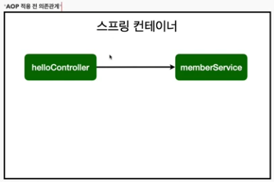
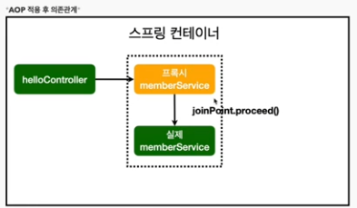
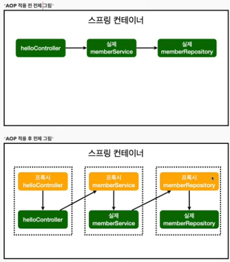

JPA
 - SQL 쿼리도 JPA가 알아서 작성해줌
 - SQL - 데이터 중심 설계에서 객체 중심으로 패러다임 변환
 - 개발 생산성 향상
 - JPA는 Interface이다. 해당 Interface를 제공받아 구현체로 Hibernate등 기술들을 만듬(여러 벤더사가 제공)
 - 해당 실습에선 Hibernate를 사용함
 - JPA는 ORM이라는 기술이다. (Object, Relational, Mapping -> Annotation으로 매핑)
 - @Commit 어노테이션 입력시 실 DB에 반여이 된다.

1. build.gradle
 - implementation 'org.springframework.boot:spring-boot-starter-data-jpa' 작성후 Ctrl + Shift + P
 - data-jpa에는 jdbc도 포함되어있기 때문에 starter-jdbc는 지워도됨
 - SpringBoot가 자동으로 EntityManager를 생성한다.(해당 객체를 주입받아서 사용)
2. Application.properties
 - spring.jpa.show-sql=true 추가(jpa가 날리는 sql확인가능)
   ex `Hibernate: select member0_.id as id1_0_, member0_.name as name2_0_ from member member0_ where member0_.name=?
   Hibernate: insert into member (id, name) values (default, ?)`
 - spring.jpa.hibernate.ddl-auto=none 추가(jpa는 객체를 보고 테이블 DDL도 알아서 생성을 함, 이 실습에서는 미리 만들어진 테이블을 사용하기 때문에 해당기능을 none 상태로 설정 후 실습을 진행함)
 - ddl-auto를 create로 바꾸면 자동ddl이 생성됨
3. @Entity 매핑

Spring Data JPA
 - JPA를 사용하기 편하게 해주는 툴
 - JPA 선행학습이 필요 
 - JpaRepository를 상속 받는 인터페이스는 인터페이스의 구현체를 스프링에서 자동으로 등록을 한 뒤, bean으로 등록을 한다.
   - 해당 구현체는 JpaRepository와 함께 상속을 받는 인터페이스의 형태로 구현을함

AOP(Aspect Oriented Programming)가 필요한 상황
 - 모든메서드의 호출 시간 측정(공통관심사항)
   Ex. 모든 메서드 앞뒤로 시간측정 로직을 붙여줌
 - 공통관심사항과 핵심관심사항을 분리함
   Ex. 시간측정 로직을 만들고, 각 메서드에 적용만 함
 - 메서드 호출마다 interceptor가 계속 걸리는 방식
 - 핵심관심사항만 깔끔하게 구현할 수 있다.
 - 변경 필요시 로직만 변경하면된다. ex.시간측정 s -> ms
 - 원하는 적용 대상 선택가능
 - 현재 사용한 AOP방식은 프록시 방식인데, 자바의 AOP방식중에는 실제코드를 메서드 앞뒤로 붙여버리는 방식도 있다.

AOP 동작방식

 - AOP적용시 가짜 member Service생성(Proxy)
 - 의존성 주입시 메서드.getClass()메서드로 확인가능
 - JoinPoint.preceed() 호출시 실제 서비스로넘어감

