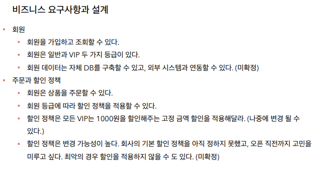
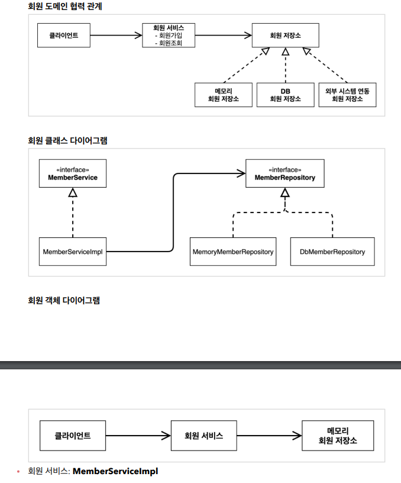
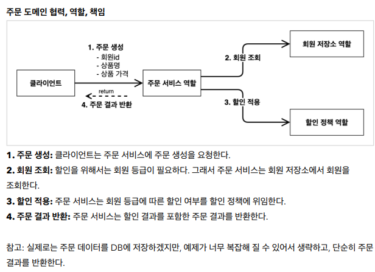
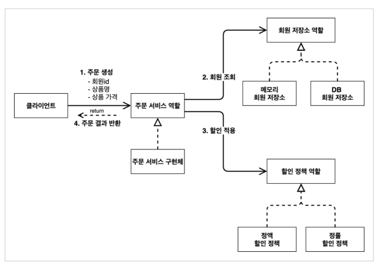

비즈니스 요구사항과 설계

 - 미확정이 난부분은 역할과 구체화 개념을 통해 미리 개발을 해둔상태에서 나중에 확정이되면 개발되어있는 구현체를 끼워넣는다.

회원가입과 조회 기능 설계

현재 바닐라JAVA의 문제점
 - 다른저장소 변경시 OCP 원칙을 잘 준수하는가?
 - 이 코드의 설계상 문제점?
 - DIP는 잘 지키고 있는가?
 - 의존관계가 인터페이스뿐 아니라 구현까지 모두 의존하는 문제점이 있음.
 - -> `memberRepository = new MemoryMemberRepository()` => 할당하는 부분이 구현체를 의존함
 - -> 추상화에도 의존하고, 구현체에도 의존하는 기현상이 발생함.

주문 할인과 도메인 설계

