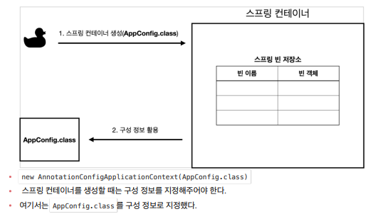
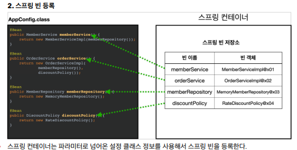

스프링 컨테이너와 스프링 빈
스프링 컨테이너 생성과정
 - ApplicationContext ac = new AnnotationConfigApplicationContext(Appconfig.class); -> AppConfig를 파라미터로 넘김
 - ApplicationContext를 스프링 컨테이너라고 지칭하며, ApplicationContext는 인터페이스이다.(다형성 적용)
 - 스프링 컨테이너는 XML기반으로도 만들수 있고, Annotation기반의 자바 설정 클래스로 만들수도 있다.
 - BeanFactory + Application Context = 스프링이지만, BeanFactory는 거의 사용되지 않기 때문에 보통 ApplicationContext를 컨테이너라고 칭한다.

 - 구성정보 지정 -> AppConfig를 넘긴 것

스프링 빈 등록

- @Bean 어노테이션이 붙은 모든 객체들을 호출하여 메서드명을 빈 이름으로 등록을하고(빈이름을 개발자가 등록을 할 수 있다.) 해당 메서드의 return값을 빈 객체로 등록을 한다.
* 빈이름은 중복되어서는 안된다.

스프링 빈 의존관계 설정
- 설정정보(AppConfig)를 참고하여 의존관계를 주입한다.
- 자바코드로 스프링 빈을 등록하면 생성자를 호출하며, 의존관계 주입도 한번에 처리가된다.
- -> Ex. MemberService생성시 new MemberServiceImpl이 생성되고, MemberRepository를 호출
- 이후 MemberRepository를 생성하는 순간 MemoryMemberRepository도 생성됨
- 이와 같이 하나를 부르는순간 의존관계가 다엮여져버림