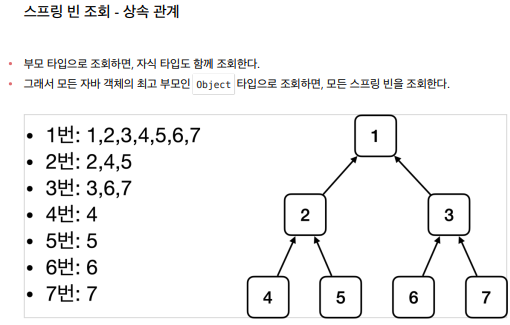

스프링 빈 조회 - 상속관계

 - 부모 빈을 조회하면 자식빈들도 함께 다 조회가 됨

BeanFactory와  Application Context
1. 최상위의 BeanFactory
2. BeanFactory를 상속받는 ApplicationContext
3. ApplicationContext를 상속받는 AnnotationConfig, ApplicationContext
=> 하위로 갈수록 부가기능이 추가됨

#BeanFactory
- 스프링 컨테이너의 최상위 인터페이스
- 스프링 빈 관리 및 조회 역할
- getBean() 제공

#ApplicationContext
- MessageSource(국제화 기능), EnvironmentCapable(환경변수), ApplicationEventPublisher(이벤트 발행 및 구독), ResourceLoader(편리한 리소스 조회)등 여러 인터페이스를 상속 받고있다.
- 