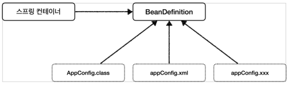

XML 형식 스프링 컨테이너 설정
XML의 장점
 - 컴파일이 필요없다.(설정파일 변경에도 문제가 안생긴다.)

BeanDefinition (스프링 빈 설정 메타정보)
- xml/java 코드를 읽어 BeanDefinition을 만들면 된다.
- Spring Container는 BeanDefinition에만 의존한다.

- AnnotationConfigApplicationContext의 `private final AnnotatedBeanDefinitionReader reader`라는 객체를 사용하여 AppConfig.class의 설정정보를 읽어와서 BeanDefinition을 생성한다.
- GenericXmlApplicationContext도 XmlBeanDefinitionReader 라는 객체가 AppConfig.xml을 읽어 BeanDefinition을 생성한다.
-> XXXBeanDefinitionReader를 생성해서 BeanDefinition을 생성할 수도있다.

빈 등록방법중 가장 큰 2가지
1. 직접 스프링빈 등록방법 
2. Factory Method를 사용(Appconfig.java)
 - 임의의 코드를 조작하여 빈 생성가능
 - 외부에서 메서드를 호출해서 생성이되는 방식