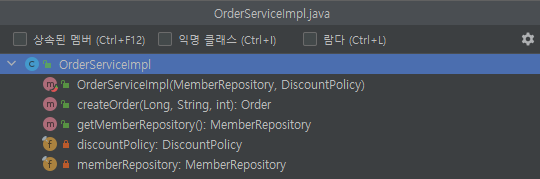
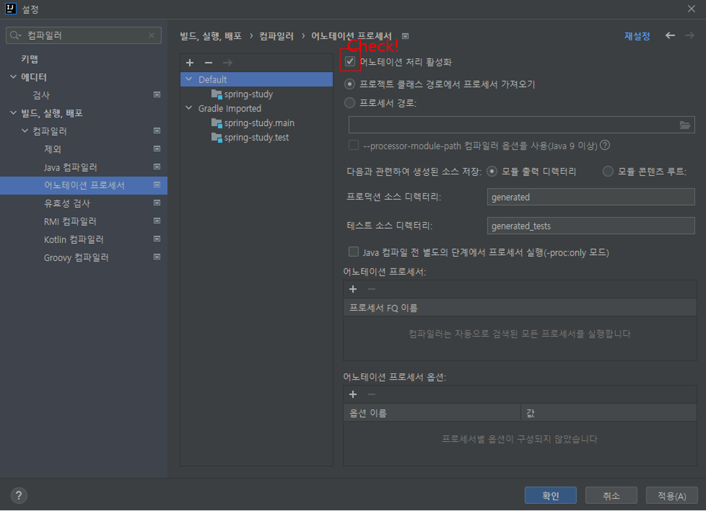
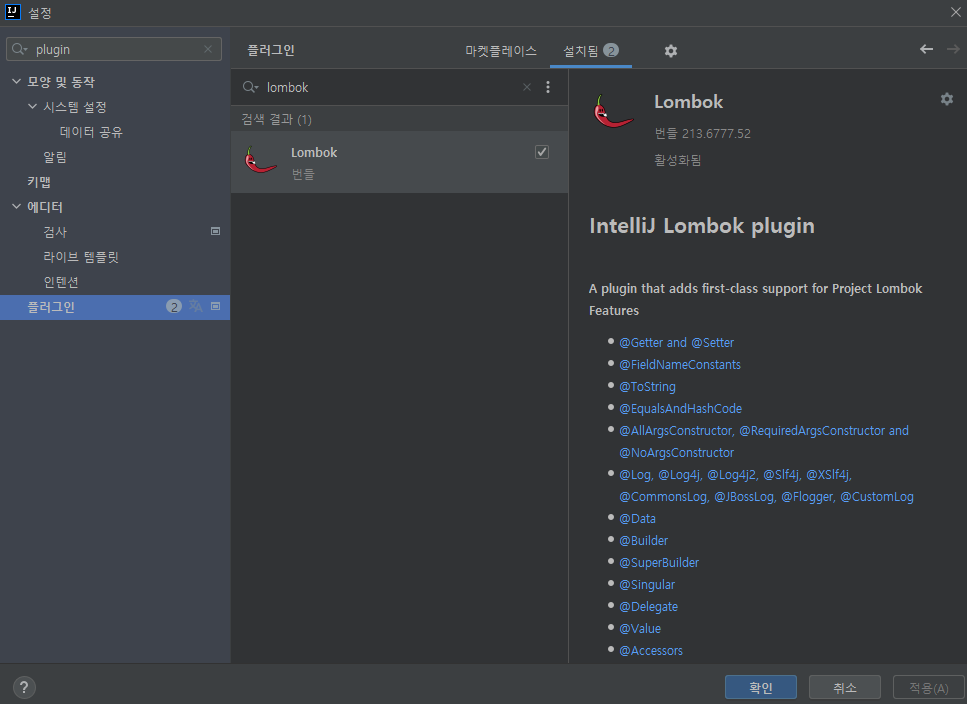

롬복
 - 생성자주입이 좋긴하지만, 코드가 너무 길어진다는 단점이 있음
 - 자바의 getter, setter, toString과 같은 메서드를 자동으로 어노테이션 프로세싱해주는 라이브러리
 - RequiredArgsConstructor final키워드가 붙은 변수에 대해 생성자를 만들어줌(ctrl + F12) + 자동 의존관계 주입

설치 방법

build.grade
 - 	//lombok 라이브러리 추가
      compileOnly 'org.projectlombok:lombok'
      annotationProcessor 'org.projectlombok:lombok'

	testCompileOnly 'org.projectlombok:lombok'
	testAnnotationProcessor 'org.projectlombok:lombok'
 - //lombok 설정 추가 시작
configurations {
compileOnly {
extendsFrom annotationProcessor
}
}

2개이상의 빈이 주입될때
 - 하나의 객체에 2개의 빈이 주입
 - Ex. DiscountPolicy <- RateDiscountPolicy & FixedDiscountPolicy

해결방법
1. @Autowired 필드명 매칭
@Autowired DiscountPolicy rateDiscountPolicy : DiscountPolicy에 rateDiscountPolicy 빈이 주입된다.
@Autowired
public OrderServiceImpl(MemberRepository memoryMemberRepository){
      this.memberRepositort = memoryMemberRepository;
}
=> 필드명/파라미터명를 확인하고 해당하는 클래스를 찾아서 자동주입해줌
2. @Qualifier 끼리 매칭
 - 추가구분자 (빈이름 등록이 아닌 추가로 구별만 해줌)
Component에 @Qualifier를 붙여둠
@Component
@Qualifier("mainDiscountPolicy")
public void DiscountPolicy(){}
.....
   @Autowired
   public OrderServiceImpl(@Qualifier("mainDiscountPolicy")MemberRepository memberRepository){
   this.memberRepositort = memberRepository;
   }
 - Qualifier끼리 매칭이 되지 않는 경우면 "mainDiscountPolicy"라는 빈객체도 한번 찾아보게 되어있다.
 - 주입받는 모든 객체에 @Qualifier가 붙기 때문에 보기도 힘들고 귀찮다.
3. @Primary 사용
 - 가장 자주사용하는 방법
 - 여러 @Autowired사용시 우선순위 지정
   @Component
   @Primary
   public void DiscountPolicy(){}

우선순위는 @Qualifier > @Primary임