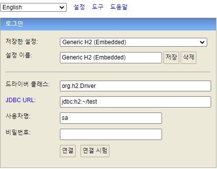

H2 DB 설치
 - 설치 후 bin폴더의 H2.bat 파일을 실행하면 브라우저에서 계정과 JDBC URL등을 설정할 수 있다.
 - url의 sessionid는 변경해선 안됨

1. DATA BASE 파일을 생성함(JDBC URL 위치에 DB 파일 생성)
2. JDBC URL의 jdbc:h2:~/test 는 `C:\Users\rjh21`에 test 경로를 생성해서 DB파일을 만들겠다는 의미임
3. 기존의 URL이 아닌 jdbc:h2:tcp://localhost/~/test와 같은 소켓을 통한 접근으로 App간 충돌을 방지함
4. 삭제시 `test.mv.db`파일을 삭제하면 됨
5. 재설치시 삭제후 H2 설치 시작

실행방법
1. `C:\Program Files (x86)\H2\bin\h2.bat`실행
2. JDBCURL 선택 후 id pw 입력한뒤 브라우저에서 작동 or 소스에서 작동

create table member
{
    id bigint generated by default as identity,
    name varchar(255),
    primary key(id)
}

- generated by default as identity => null 입력시 default 설정

insert into member(name) values('spring')