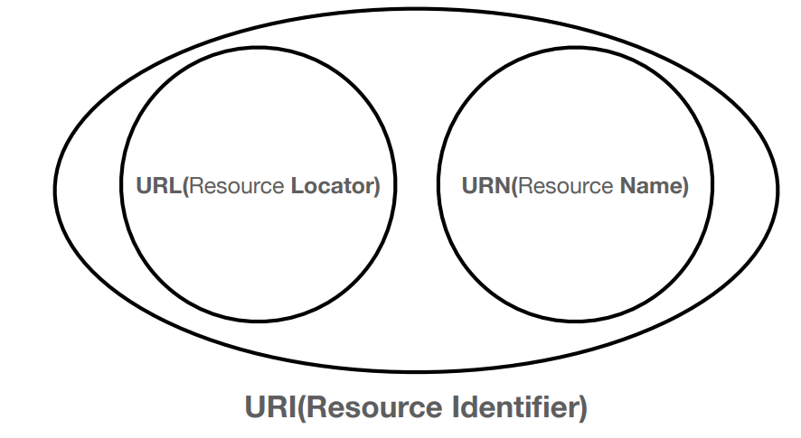

IP 프로토콜
 - 지정한 IP 주소에 데이터 전송(단위 : 패킷)
 - 출발 / 도착 ip등 정보를 가지고 전달
 - 중간 노드(서버)들을 거쳐가며 데이터전송
IP 프로토콜의 한계
 - 비 연결성 : 패킷 받을 대상이 없거나, 서비스 불능상태에도 전송이됨
 - 비 신뢰성 : 전송도중 패킷 소실 / 패킷 순서 보장 x
 - -> TCP 프로토콜로 문제를 보완함

 TCP 프로토콜(단위 : 세그먼트)
 1. 애플리케이션단에서 소켓라이브러리를 통해 OS계층에 데이터를 넘김
 2. OS계층에서 데이터위에 TCP정보를 덧씌움
    - 출발/도착지 포트, 전송제어 , 순서 , 검증정보등 포함
 3. IP계층에서 IP 관련 정보를 덧씌워서 패킷을 생성함
 4. 네트워크 인터페이스에서 Ethernet frame(LAN카드의 맥주소 등..)을 덧씌워서 랜카드 밖으로 전송이ㄷ 시작됨

TCP 특징
 - 연결 지향 : 선연결 후 전달(상대방의 상태가 받을수 없는 상태라면 전송되지 않음)
 - 데이터 전달 보증 : 전달 완료시 서버에서 전달을 받았다는 답장을줌
 - 순서 보장 : 잘못온 순서부터 재전송 요청

TCP 3 WAY HANDSHAKE
1. CLIENT -> SERVER로 SYN 전달
2. SERVER가 받을수 있는 상태라면 SYN + ACK 를 CLIENT로 전달
3. CLIENT -> SERVER로 ACK를 전달하여 데이터전송 가능 상태로 변경

UDP의 특징
 - TCP와 다르게 다른기능이 거의 없고, PORT정보만 덧씌워서 전달을함
 - TCP는 이미 보급화가 되어있어 기능 수정을 할 수 없지만, 자신만의 기능을 추가하고자하면 UDP에 추가를 하여 사용

PORT
 -한번에 2개이상의 통신이 필요한 경우사용
 - 나에게 날아오는 패킷을 어플리케이션 별로 구분을 한다.

DNS
 - IP가 변경되거나 IP번호를 외우기 힘드니 DNS서버에 자신의 IP와 DN을 매칭시켜서 관리함

URL 입력시 발생 과정
1. DNS서버에서 해당 URL에 해당하는 IP획득
2. IP를 가지고 TCP/IP전송

URI
 - Uniform Resource Identifier

 - 자원을 식별하는 방법
 - url입력시  http/https 는 각각 80/ 443 port를 쓰므로, url의 port를 생략해도 제대로 동작을 하게된다.

HTTP
 - 실무에서는 직접 TCP로 연결하는 경우가 거의 없고 대부분 HTTP를 통해 통신을 한다.
 - HTTP1, HTTP2은 TCP 기반
 - HTTP3은 속도개선을위해 UDP 기반으로 설계했다.

HTTP특성
 1. 클라이언트 - 서버 구조
 2. 무상태 프로토콜(Stateless), 비연결성
 3. HTTP메세지
 4. 단순함, 확장가능

클라이언트 - 서버 구조
 - Request Response 구조
 - 클라이언트는 서버에 요청을 보내고, 응답을 대기한다.
 - 서버는 요청에 대한 결과를 만들어서 응답한다.
 - 양쪽을 독립적으로 관리를 할 수 있다는 장점이 생긴다.

Stateless(무상태 프로토콜)
 - 서버가 클라이언트의 상태를 보존하지 않는다.
   - 클라이언트의 상태를 서버에 저장해두지 않는다.
 - 서버확장성이 높다.(Scale Out)
   - 응답서버를 마음껏 확장해도 큰 문제가 없다.
   - Stateful일 경우는 서버끼리 클라이언트의 객체를 서로 알고있어야 한다.
 - 클라이언트가 추가 데이터를 전송해야한다.
   - 전송 용량이 점점 늘어난다.

Stateful
 - 로그인기능 구현등 상태를 유지해야할 경우 사용
 - 상태유지는 최소한으로 사용

비연결성
 - 연결을 유지하지않기 때문에 서버는 최소한의 자원으로 서버를 운영할 수 있다.
 - 기본적으로 HTTP는 모두 비연결성을 가진다.
비연결성의 문제점
 - 클라이언트 연결시마다 3 way HandShaking과정을 거쳐야 한다.

HTTP 메세지
 - HTTP 를 사용하여 XML 부터 영상까지 모든 데이터를 전송할 수있다.
 - HTTP는 응답/요청 메시지로서 전달이 된다.
 - 메세지 구조는 StartLine - Header - EmptyLine - [MessageBody] 순으로 전달이된다.

요청메시지
 - StartLine : requestLine/StatusLine
 - RequestLine : 메서드(Get/Post/Put 등..) + Request Target(Path : 절대경로 + 쿼리 + HTTP버전) + CRLF(엔터)
응답메시지
 - StartLine : RequestLine + StatusLine(HTTP 버전 + 상태코드 + 상태코드명)
 - Header : field-name + ":" + 필드값(value)
   - HTTP 전송에 필요한 모든 부가정보가 다 들어가있다.
     - ex. 데이터의 body 내용 / 크기 / 인증상태 등을 나타내는 메타데이터
   - 임의의 헤더를 추가할 수 있음.(약속된 server-client만 이해할 수 있음)

HTTP API
 - 리소스와 행위는 분리되어야 한다.
 - uri는 리소스만 식별
 - 행위는 ...(조회,등록,삭제,... GET, POST 등...)

HTTP 메서드 종류
 - GET : 리소스 조회(조회 조건을 일부분 캐싱을 하므로 잦은 조회시 POST 조회에 비해 유리함)
 - POST : 요청 데이터 처리
 - PUT : 리소스를 대체, 없다면생성
 - PATCH : 리소스 부분변경
 - DELETE : 리소스 삭제
 - HEAD : GET과 동일하지만 HTTP의 BODY를 제외하고 전달받음
 - OPTIONS : 통신가능 옵션
 - CONNECT : 서버와 터널링
 - TRACE : 대상 리소스에 대한 경로를 따라 메시지 루프백 테스트를 수행