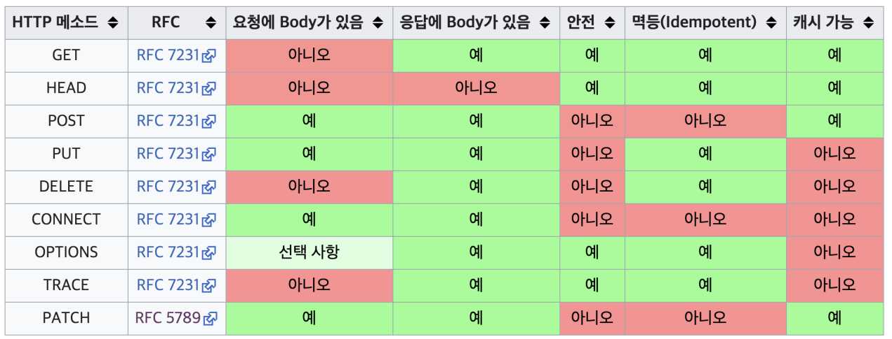
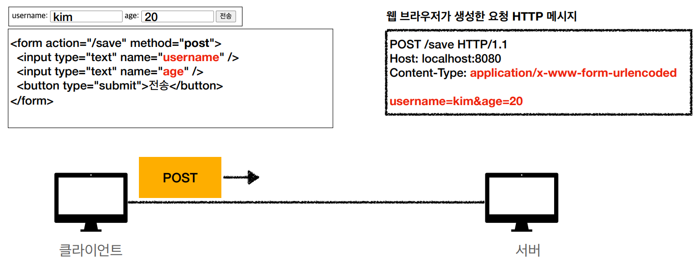

IP 프로토콜
 - 지정한 IP 주소에 데이터 전송(단위 : 패킷)
 - 출발 / 도착 ip등 정보를 가지고 전달
 - 중간 노드(서버)들을 거쳐가며 데이터전송
IP 프로토콜의 한계
 - 비 연결성 : 패킷 받을 대상이 없거나, 서비스 불능상태에도 전송이됨
 - 비 신뢰성 : 전송도중 패킷 소실 / 패킷 순서 보장 x
 - -> TCP 프로토콜로 문제를 보완함

 TCP 프로토콜(단위 : 세그먼트)
 1. 애플리케이션단에서 소켓라이브러리를 통해 OS계층에 데이터를 넘김
 2. OS계층에서 데이터위에 TCP정보를 덧씌움
    - 출발/도착지 포트, 전송제어 , 순서 , 검증정보등 포함
 3. IP계층에서 IP 관련 정보를 덧씌워서 패킷을 생성함
 4. 네트워크 인터페이스에서 Ethernet frame(LAN카드의 맥주소 등..)을 덧씌워서 랜카드 밖으로 전송이ㄷ 시작됨

TCP 특징
 - 연결 지향 : 선연결 후 전달(상대방의 상태가 받을수 없는 상태라면 전송되지 않음)
 - 데이터 전달 보증 : 전달 완료시 서버에서 전달을 받았다는 답장을줌
 - 순서 보장 : 잘못온 순서부터 재전송 요청

TCP 3 WAY HANDSHAKE
1. CLIENT -> SERVER로 SYN 전달
2. SERVER가 받을수 있는 상태라면 SYN + ACK 를 CLIENT로 전달
3. CLIENT -> SERVER로 ACK를 전달하여 데이터전송 가능 상태로 변경

UDP의 특징
 - TCP와 다르게 다른기능이 거의 없고, PORT정보만 덧씌워서 전달을함
 - TCP는 이미 보급화가 되어있어 기능 수정을 할 수 없지만, 자신만의 기능을 추가하고자하면 UDP에 추가를 하여 사용

PORT
 -한번에 2개이상의 통신이 필요한 경우사용
 - 나에게 날아오는 패킷을 어플리케이션 별로 구분을 한다.

DNS
 - IP가 변경되거나 IP번호를 외우기 힘드니 DNS서버에 자신의 IP와 DN을 매칭시켜서 관리함

URL 입력시 발생 과정
1. DNS서버에서 해당 URL에 해당하는 IP획득
2. IP를 가지고 TCP/IP전송

URI
 - Uniform Resource Identifier

 - 자원을 식별하는 방법
 - url입력시  http/https 는 각각 80/ 443 port를 쓰므로, url의 port를 생략해도 제대로 동작을 하게된다.

HTTP
 - 실무에서는 직접 TCP로 연결하는 경우가 거의 없고 대부분 HTTP를 통해 통신을 한다.
 - HTTP1, HTTP2은 TCP 기반
 - HTTP3은 속도개선을위해 UDP 기반으로 설계했다.

HTTP특성
 1. 클라이언트 - 서버 구조
 2. 무상태 프로토콜(Stateless), 비연결성
 3. HTTP메세지
 4. 단순함, 확장가능

클라이언트 - 서버 구조
 - Request Response 구조
 - 클라이언트는 서버에 요청을 보내고, 응답을 대기한다.
 - 서버는 요청에 대한 결과를 만들어서 응답한다.
 - 양쪽을 독립적으로 관리를 할 수 있다는 장점이 생긴다.

Stateless(무상태 프로토콜)
 - 서버가 클라이언트의 상태를 보존하지 않는다.
   - 클라이언트의 상태를 서버에 저장해두지 않는다.
 - 서버확장성이 높다.(Scale Out)
   - 응답서버를 마음껏 확장해도 큰 문제가 없다.
   - Stateful일 경우는 서버끼리 클라이언트의 객체를 서로 알고있어야 한다.
 - 클라이언트가 추가 데이터를 전송해야한다.
   - 전송 용량이 점점 늘어난다.

Stateful
 - 로그인기능 구현등 상태를 유지해야할 경우 사용
 - 상태유지는 최소한으로 사용

비연결성
 - 연결을 유지하지않기 때문에 서버는 최소한의 자원으로 서버를 운영할 수 있다.
 - 기본적으로 HTTP는 모두 비연결성을 가진다.
비연결성의 문제점
 - 클라이언트 연결시마다 3 way HandShaking과정을 거쳐야 한다.

HTTP 메세지
 - HTTP 를 사용하여 XML 부터 영상까지 모든 데이터를 전송할 수있다.
 - HTTP는 응답/요청 메시지로서 전달이 된다.
 - 메세지 구조는 StartLine - Header - EmptyLine - [MessageBody] 순으로 전달이된다.

요청메시지
 - StartLine : requestLine/StatusLine
 - RequestLine : 메서드(Get/Post/Put 등..) + Request Target(Path : 절대경로 + 쿼리 + HTTP버전) + CRLF(엔터)
응답메시지
 - StartLine : RequestLine + StatusLine(HTTP 버전 + 상태코드 + 상태코드명)
 - Header : field-name + ":" + 필드값(value)
   - HTTP 전송에 필요한 모든 부가정보가 다 들어가있다.
     - ex. 데이터의 body 내용 / 크기 / 인증상태 등을 나타내는 메타데이터
   - 임의의 헤더를 추가할 수 있음.(약속된 server-client만 이해할 수 있음)

HTTP API
 - 리소스와 행위는 분리되어야 한다.
 - uri는 리소스만 식별
 - 행위는 ...(조회,등록,삭제,... GET, POST 등...)

HTTP 메서드 종류
 - GET : 리소스 조회(조회 조건을 일부분 캐싱을 하므로 잦은 조회시 POST 조회에 비해 유리함)
 - POST : 요청 데이터 처리
 - PUT : 리소스를 대체, 없다면생성(기존의 리소스를 제거하고, 새로 생성을 하는 구조임)
   - Post와 다른점은 Client가 정확한 경로를 알고, URI를 지정한다.
 - PATCH : 리소스 부분변경
   - Put과 달리 전송하는 리소스만 갱신 or 추가한다.
 - DELETE : 리소스 삭제
 - HEAD : GET과 동일하지만 HTTP의 BODY를 제외하고 전달받음
 - OPTIONS : 통신가능 옵션
 - CONNECT : 서버와 터널링
 - TRACE : 대상 리소스에 대한 경로를 따라 메시지 루프백 테스트를 수행

HTTP 메서드의 속성

1. 안전(Safe)
 - 호출을 해도 리소스를 변경하지않는다.(GET / HEAD 등)
2. 멱등(Idempotent)
 - 몇번을 호출하든(같은 요청을 여러번 하는 경우) 결과는 같다.(GET / PUT 등)
 - 같은 요청 반복 요청 중간에 리소스가 변경되는 경우는 고려하지 않는다.
 - 멱등인 메서드는 TIMEOUT등 정상 응답을 못주었을때 클라이언트가 재요청을 해도 큰 문제가 생기지 않는다.
3. 캐시 가능
 - 로컬서버에 리소스를 저장하고 있음(GET/HEAD 등)

HTTP 메서드 활용 (Client to Server)
1. 쿼리 파라미터를 통한 데이터전송(쿼리 스트링)
 - GET(정렬필터 등..)
2. 메시지 바디를 통한 데이터 전송
 - POST, PUT, PATCH등(회원가입, 상품주문 등)

정적 데이터 조회
 - 이미지 / 정적 텍스트 문서
 - 일반적으로 쿼리파라미터 없이 리소스 경로로 단순조회 가능

동적 데이터 조회
 - 검색 및 목록 정렬 필터(Order by)로 사용
 - 조회 대상을 줄여주는 필터 역할
 - 쿼리파라미터를 통해 데이터전달 

HTML Form 데이터 전송(GET,POST만 지원)

 - button submit을 POST로 전송을 하게되면 form 내부의 파라미터를 메세지 바디에 담아서 HTTP 메세지를 생성해줌
 - button submit을 GET형태로 전송을 하게되면 메세지 바디에 담은정보를 uri형태로 바꿔서 전달을함 

Multipart Form DATA 전송(GET,POST만 지원)
 - 데이터 전송시 boundary를 통해 경계를 생성하여 여러 Data 전송에도 헷갈리지 않게한다.
 - 바이너리 데이터(사진, 파일등)전송시 주로사용

HTTP API 데이터 전송
1. Server to Server 통신에 주로 사용
2. 아이폰/안드로이드와 같은 앱 클라이언트에서 주로 사용
3. HTML에서 Form 대신 AJAX통신시 주로 사용

HTTP API 설계 예시(https://restfulapi.net/resource-naming 참고)
1. HTTP API - 컬렉션
 - POST 기반 예시
   - 컬렉션 : 서버가 관리하는 리소스 디렉토리 (새로운 리소스 신청시 디렉토리를 서버에서 생성 및 URI 등록)
   - EX. /MEMBERS
2. HTTP API - 스토어
 - PUT 기반 예시
   - CLIENT에서 리소스 URI를 알고있어야함 -> 덮어쓰기 및 신규등록을 위해서
   - EX. /FIELS/STAR.JPG
   - 스토어 : 클라이언트가 관리하는 리소스 저장소 (클라이언트에서 리소스 URI를 입력하여 직접 관리한다.)
3. HTML FORM(AJAX 사용 안하는 경우)
 - GET / POST만 지원
 - 컨트롤 URI
   - SUBMIT 버튼에서는 GET/POST만 사용이 가능하기 때문에 삭제등 특별한 작업을 하는경우 URI마지막에 DELETE등을 붙여서 URI를 생성한다.
   - EX. MEMBERS/{ID}/DELETE
   
HTTP 상태코드
 - 클라이언트가 보낸 요청의 처리 상태를 응답으로 알려주는 기능
1. 1xx : 처리중
2. 2xx : 정상 처리
3. 3xx : 요청 완료를 위한 추가 행동필요
4. 4xx : 클라이언트 오류
5. 5xx : 서버오류

200 Status
201 : Created - 새로운 리소스가 생성됨
202 : Accepted - 요청 접수까지만 완료
204 : No contents - 요청 수행까지 완료했지만, 응답 Payload 본문에 보낼 데이터가 없을경우

300 Status - redirect
  1. 웹브라우저가 서버로 구버전의 URL로 데이터를 요청
  2. 서버의 응답에 3xx의 Status와 함께 신규경로의 URL를 붙여서 응답을 전달
  3. 웹 브라우저는 3xx응답의 결과에 Location 헤더가 있다면, Location 위치로 자동이동함
  4. 브라우저는 응답받은 URL로 자동 리다이렉트함
  - 리다이렉션
    1. 영구 리다이렉션 : 특정 리소스의 URL이 영구적으로 이동
    2. 일시 리다이렉션 : 일시적으로 이동, 주문완료 후 주문목록으로 자동변경
    3. 특수 리다이렉션 : 브라우저의 캐시에 이미 존재하는 경우 서버가 해당 캐시를 사용하라고 리다이렉션을 전달

1. 영구 리다이렉션 301 /308
- 301 Moved Permanently
  - 리다이렉트시 요청 메서드가 GET으로 변하고 body or queryString이 삭제될 수도 있음
- 308 Permanent Redirect
  - 301과 기능은 같지만 리다이렉트 시에도 POST + body로 리다이렉트를 보냄
  => 잘못된 페이지로 요청을 보냈을시 애초에 입력값들이 모두 바뀔 확률이 높기때문에 굳이 308로 body를 유지한채 리다이렉트 하지않음

2. 일시적 리다이렉션 302 307 303
- 302 Found
  - 리다이렉트시 요청 메서드가 GET으로 변할 수도 있음 & 본문이 제거될 수 있음 (MAY) 
- 307 Temporary Redirect
  - 리다이렉트시 요청 메서드와 동일한 메서드 & 본문 유지 (MUST NOT)
- 303 See Other
  - 리다이렉트시 요청 메서드가 GET으로 변함(MUST)
- PRG POST/Redirect/Get
  - Post로 주문후 결과화면을 GET메서드로 리다이렉트
  - EX.Post로 상품 주문 후 브라우저 새로고침? -> Post로 Redirect 한다면 중복주문이 들어갈 수가 있음
  - 새로고침은 마지막 URL요청을 다시 전송하기 때문에 위와같은 문제가 발생할 수있음
  - PRG를 통해 위 사항 예방가능

3. 기타 리다이렉션 300 304
- 300 Multiple Choices : 사용 안됨
- 304 Not Modified : 캐시를 목적으로 사용
  - 클라이언트에게 리소스가 수정되지 않앗음을 알려줌
  - Body를 포함시킬 필요가 없음

400 status - 클라이언트에서의 오류
 - 잘못된 문법, 잘못된 경로 등
 - 반복 실행에도 계속해서 같은 오류가 날 수 밖에없음
1. 400 : 요청 구분/ 메세지 등 오류(메세지가 LowerCase여야 하는 경우)
2. 401 : 클라이언트가 해당 리소스에 대한 인증을 해야함 (로그인 or 권한 등)
3. 403 : 서버가 승인거부 ( 접근권한이 없는 경우 )
4. 404 : 요청 리소스가 서버에 없음(or 서버에서 숨기는 경우)

500 Status - 서버에서의 오류
 - 반복실행시 서버가 고쳐진다면 정상실행이 될 수도 있음
1. 500 : 서버 내부문제로 오류 발생(서버에서의 애매한 오류는 모두 500으로 처리)
2. 503 : 서비스 이용 불가(서비스의 일시적 과부하 / 작업으로 인해 잠시 요청 거부 상태 -> Retry-After Header 필드로 얼마뒤에 복구되는지 알 수 있음)

HTTP Header
 - 일반적인 헤더, 캐시 및 조건부 요청을 위한 헤더로 구분
 - HTTP 전송에 필요한 모든 부가정보를 담는다.
   - 바디의 내용 / 크기 /압축 /인증 / 요청 클라이언트 / 서버정보 등등
 - 최신 HTTP BODY는 표현 헤더 + 표현 데이터로 이루어진다.
   - 표현 헤더 : 표현 데이터를 해석할 수 있는 방법 제공

Representation Header
 - Content Type : 표현 데이터의 형식 (html or json ...)
 - Content Encoding : 표현 데이터의 압축방식 (File, Image등 Data 전송시 어떤 방식으로 압축하여 전송하는가?)
 - Content Language : 표현 데이터의 자연 언어(ko, en, en-US ...)
 - Content Length : 표현 데이터의 길이(PayLoad의 길이, Transfer-Encoding사용시에는 사용하면 안됨)
 - 표현 헤더는 Request / Response에서 모두 사용

협상(Content Negotiation) 헤더
 - 클라이언트가 선호하는 표현을 서버에게 요청
 - Accept : 클라이언트가 선호하는 미디어 타입
   - 구체적으로 작성한 항목을 우선순위로 매칭시킴 EX) Accept : text/plain > Accept : text/*
   - 우선순위 지정가능 EX) Accept:text/plain;q=0.4,text/*;q=0.9,*/*;q=1
 - Accept Charset : 클라이언트가 선호하는 문자 인코딩
 - Accept Encoding : 클라이언트가 선호하는 압축 인코딩
 - Accept Language : 클라이언트가 선호하는 자연 언어
   - 0~1 사이의 값으로 언어의 우선수위를 부여가능 Ex) Accetp-Language: ko-KR, ko;q=0.9, en-US;0.8 ...
   - 서버에서 우선순위를 보고 가장높은 순위의 우선순위로 언어를 선택하여 전달
 - 협상 헤더는 요청시에만 사용함

전송 방식 설명
1. 단순 전송
 - 응답시 Content-Length를 지정하여 응답함(길이를 알경우에 사용 가능)
2. 압축 전송
 - 서버에서 gzip과 같은 방식으로 데이터를 압축하여 전달함(Content-Encoding)
 - 전송 용량이 매우 적어짐
3. 분할 전송
 - Chunk를 사용하여 데이터 전송
 - 지정 길이만큼 순차적으로 응답을함
 - 클라이언트 입장에서는 응답이 빠르게 느껴질 수 있음
 - Content-Length가 Chunk별로 존재하므로 Content-Length를 적어서는 안됨
4. 범위 전송 
 - 범위를 지정하여 요청시 응답도 해당 범위만큼만 전송

일반 정보
1. From
 - 유저 에이전트의 이메일 정보
2. Referer
 - 이전 페이지의 정보
 - 유입경로등 분석가능
3. User-Agent
 - 클라이언트 App 정보(브라우저 정보)
 - 서버입장에서는 특정 브라우저에서 생기는 버그인지 확인 가능함
4. Server
 - 요청을 처리하는 ORIGIN 서버의 소프트웨어 정보
 - 중간에 거치는 프록시서버가 아닌 최초 응답을한 소프트웨어의 정보
5. Date
 - 응답에서만 사용하며, 메시지가 발생한 날짜와 시간 정보

특별 정보
1. Host
 - 필수값 헤더
 - 하나의 서버에서 여러 도메인을 처리할때 도메인을 구분해주는 역할
2. Location
 - 3xx 응답의 결과에 Location 헤더가 있다면, Location 위치로 자동 이동을함 (Redirect) 
3. Allow
 - 405 Status에서 응답을 전송하며 허용 가능한 HTTP 메서드를 클라이언트에게 알림
 - EX. PUT / GET만 사용가능
4. Retry - After
 - 503 Status에서 서비스가 언제까지 불능인지 공지해줌

인증관련 헤더
1. Authorization
 - Client 정보를 서버에 전달
 - 인증 방법 마다 값이 달라짐
2. WWW-Authenticate
 - 리소스 접근시 필요한 인증방법 정의
 - 401 Status에서 응답에 인증방법을 포함시켜서 응답을함

쿠키
 - 쿠키를 사용할 때는 2개의 헤더(Set-Cookie(서버 to 클라이언트) / Cookie(클라이언트가 서버에서 받은 쿠키를 저장후 HTTP요청시 사용))를 사용함
 - HTTP는 무상태 프로토콜이므로, 요청/응답이 완료되면 연결이 끊어져버린다. 이를 대비해 반드시 필요한 정보를 브라우저에 쿠키로 마련해둔다.

쿠키가 없다면?
 - 모든 요청에 사용자 정보를 포함 시켜서 전송하도록 개발해야함
   - 쿠키가 있다면 쿠키의 정보가 자동으로 Header에 실려서 서버로 요청이감
 - 브라우저 완전 종료후 재시작시 다시 로그인을 해야함

쿠키 설정
 EX) set-cookie : sessionId=ABCD123; Expires = Sat, 260Dec-2022; path=/; domain=google.com;Secure
 - domain : 해당 도메인 및 서브 도메인에 대해서 쿠키 접근 허용, 도메인 생략시 해당 도메인에서만 쿠키접근 허용
 - Path : 해당 경로 및 하위 경로에 대해서만 쿠키 접근 허용
 - 보안
   - Secure : Https에만 전송
   - HttpOnly : XSS 공격 방지 / JS에서 쿠키 접근 불가 / HTTP 전송에서는 전송 됨
   - SameSite : 요청 도메인과 쿠키에 설정된 도메인이 같은경우에만 쿠키전송

쿠키의 문제점
 - 쿠키정보는 항상 서버에 전송이 되므로, 네트워크 트래픽이 추가로 발생하게된다.
 - 서버로 보내고 싶지 않다면 웹스토리지를 사용(localStorage / sessionStorage)

쿠키의 생명주기
 - Set-Cookie
   - expires에 작성한 만료일에 자동으로 삭제가 됨
 - Set-Cookie : max-age = 3600
   - max-age에 0이나 음수를 지정하면 삭제가 됨
   - 초단위 세팅
 - 세션쿠키 : 만료날자 생략시 브라우저 종료까지만 유지
 - 영속쿠키 : 만료날짜를 입력하면 해당 날짜까지만 유지

캐시의 기본동작
 - 캐시가 없을 경우에는 같은요청을 반복하더라도 같은 크기의 응답을 계속 보내야한다.
 - cache-control 파라미터를 사용하여 유효 시간을 지정한 후 캐시 데이터를 전송한다.
 - 캐시 유효시간 만료후 재 요청시 기존 캐시 삭제후 덮어씀
 - request Header영역에서 확인가능
 - 새로고침후 png등 파일을 클릭하여 확인해보면 304응답으로 온 항목들이 존재함을 확인

캐시의 장점
 - 전송 속도 상승 및 네트워크양 감소

캐시 시간 초과
 - 캐시 시간 초과시에는 서버에서 내려줄 데이터가 바뀌거나, 그대로 이거나 2가지 경우가 존재함
 - 데이터가 바뀌지 않은 경우, 검증을 통해 만료된 캐시를 재사용 할 수 있도록 해줌 -> 전송효율 증가

검증 헤더 : Last-Modified - 마지막 수정일 지정
검증 과정
 - Last-Modifed가 지정된 캐시데이터가 있따면, 서버 요청시 해당 일자를 if-modified-since로 실어서 요청을보냄
 - 서버 데이터의 최종 수정일과 비교를 하여 바뀐데이터인지 판별
1. 캐시가 서버와 동일할 경우
 - 바뀌지 않았을경우 304 Status의 응답을 보내주고, cache-control과 Last-modified를 다시 입력하여 보낸다. (body는 제외하고 전송)
 - 이후 브라우저는 브라우저 캐시 영역에서 조회를 함
 - 
2. 캐시가 서버와 달라졌을 경우
 - Client의 Last Modified와 서버의 Last Modified를 비교하여 변경확인
 - 200 Status로 전송(Body를 포함시켜서)
조건부 요청
 - Etag를 사용하여 고유한 버전명을 매핑시켜둠
 - 캐시를 해시알고리즘에 적용해서 캐시가 서버와 동일한지 확인가능
 - 다른경우 서버에서 ETag로 전송을 해줌(304 Status)
캐시 제어 헤더
 - Cache-Control
   - 캐시 제어를 위한 헤더
   - max-age : 캐시 유효시간
   - no-cache : 프록시 서버에서는 검증할 필요가 없지만, origin 서버에서 검증을 하고 사용한다.
   - no-store : 민감한 정보가 있을 경우, 캐시로 저장하고 있으면 안됨
   - must-revalidate : 캐시 만료후 최초 조회시 원 서버에 검증을 해야함
 - pragma
   - Cache-Control의 하위호환 이므로 잘 사용하지 않음
 - expired
   - 날짜를 지정하여 캐시 만료일을 정하지만, 잘 사용하지 않음
   - max-age와 동시사용시 무시됨

프록시 캐시
1. 원서버가 물리적으로 굉장히 먼곳에 존재한다면, 자료를 요청하는 Client들은 동일한 로딩을 계속해서 겪어야한다.
2. 프록시 캐시를 도입하여, 물리적으로 근거리에 위치한 서버에 캐시를 저장해둔다.(프로시 캐시 서버 - public 캐리)
3. Client들은 프록시 캐시를 사용하여 빠르게 자료를 전송받는다.(private 캐시로 가져옴(본인 브라우저에서 사용하게될 캐시))
4. 자주사용하는 유튜브 컨텐츠등을 캐시로 저장하여 빠르게 전송하고, 비인기 항목들은 캐시해두지 않기때문에 느린경우가 발생한다.
5. Cache-Control의 옵션을 통해, public/private 캐시저장 가능여부를 결정할 수 있다.

캐시 무효화
 - 브라우저가 임의로 캐시를 할수도 있는데 이를 막으려고 하는 기능
 - `Cache-Control : no-cache , no-store, must-revalidate` 입력