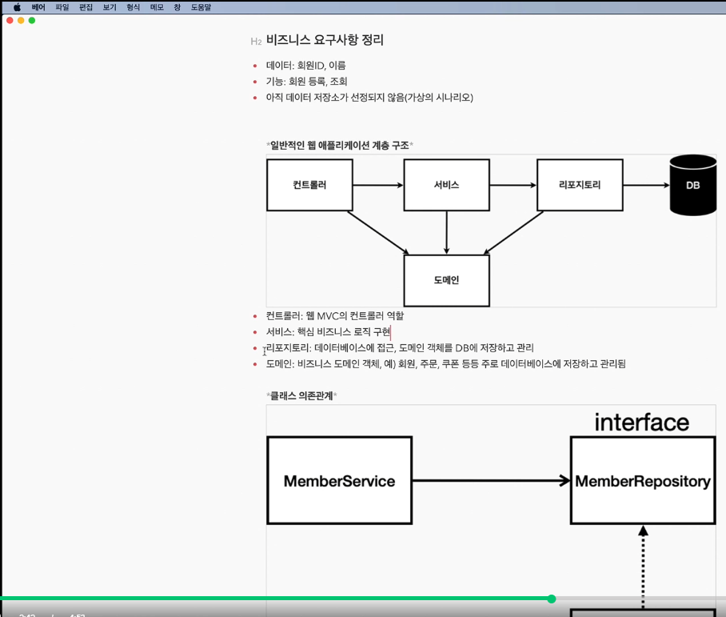
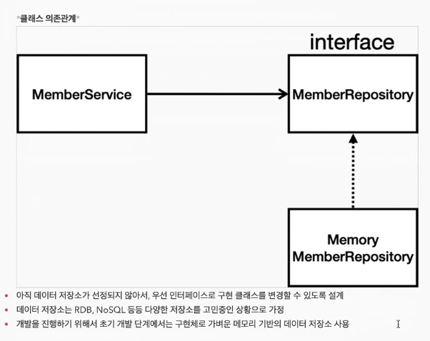
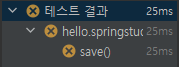

Repository는 아직 DB선정이 되지 않았다는 시나리오에 의해서 Memory기반으로 설계함

- Optional => Java8 부터 생긴기능 getId, getName등에서 가져올게 없으면 null을 가져오는게 아니라 Optional이라는 형태로 감싸서 가져오게 됨
- 실무에서는 공유되는 자원일경우 동시성 문제가 있을수 있기 때문에 그냥 HashMap이 아닌 컨커런트(?)해시맵을 주로 사용함 
- 인터페이스 구현체 테스트를 위해 테스트 케이스 작성(test/java/..) => 코드를 코드로 검증함
- 기존의 방식대로 테스트를 위해 Main을 실행하거나 WAS를 띄워 직접 테스트 해보는 경우에는 초반에 '준비 / 실행 / 반복실행 / 여러 TEST를 한번에 테스트' 하기가 어려움
- JAVA에서는 JUNIT 이라는 프레임워크로 테스트 코드를 만들어서 테스트 코드 자체를 실행하여 위와같은 문제를 해결함
- TEST에서 Assortions를 통해 equals확인을 하는경우 아래와 같이 같은지 틀린지 확인을 할 수있다.
- 
- test 폴더를 사용시 메서드 / 클래스 / 폴더 단위로 테스트를 할 수있다.
- 여러 메서드를 동시에 테스트 할 경우 순서가 보장되지 않음. 그렇기 때문에 여러 메서드를 실행 할 경우 독립적으로 실행을 시켜야 정상적으로 테스트가 가능해짐
- afterEach 메서드를 통해 테스트 메서드가 수행이 끝날 경우 공용 자원에 대한 자원 해제를 통해 의존성을 사라지게한다.

TDD: 테스트 주도 개발
 - 테스트 케이스를 먼저 생성(src/test/..)후 테스트 케이스의 틀에 맞도록 구현 클래스를 개발하는 방법
 -