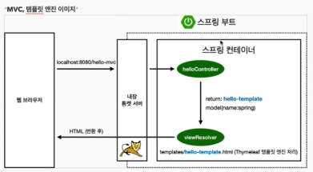
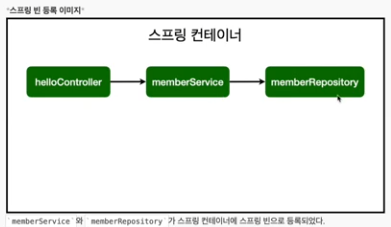

@Controller
- 컨트롤러 생성 후 클래스에 위 어너테이션을 달아주면 기능은 없지만, 스프링이 초반이 뜰때 스프링 컨테이너가 생기고, 하위 클래스 객체를 생성해서 해당 컨테이너에 미리 넣어두고 스프링이 관리를 하게함.
  => Spring Container에서 bean이 관리된다.
    
- Controller에서 Service의 객체를 new로 생성하여 관리를 할 수 있지만, 스프링이 관리를 할때는 스프링 컨테이너에서 생성한 객체를 가져다가 쓰는게 올바른 방식이다. & 부가적인 효과가 있다.
- ex. private final MemberService memberService = new MemberService(); ->  생성자를 통한 의존성주입

 
@Autowired
 - 생성자에 위 어노테이션이 붙어있으면 스프링 컨테이너의 객체로 의존성을 주입시킴

@Service
 - 스프링이 올라갈때 해당 클래스를 스프링컨테이너에 객체로 생성해둠
 - @Controller와 비슷
 - @Repository도 마찬가지

=> @Contoroller / Service / Repository를 컨테이너의 객체로 생성하며, 생성자를 실행하게 되는데 해당 생성자에 @Autowired가 있다면 컨테이너의 객체를 주입해줌

Spring Bean등록방법
 - 기본적으로 싱글톤 디자인패턴을 통해 Bean을 등록함(설정을 통해 싱글톤을 사용하지 않을 수도 있음)
1. 컴포넌트 스캔 후 자동 의존관계설정
 - 스프링이 시작되는 패키지내의 소스에서만 컴포넌트 객체 자동 등록가능(설정을 하면 외부 패키지에서도 ComponentScan작동 할 수 있게 설정가능)(@SpringBootApplication 어노테이션 내부에서 확인가능)
 - @Controller/service/repository와 같은 어노테이션 내에 컴포넌트 어노테이션이 포함되어 있다.
 - @Component 어노테이션이 있으면, 컨테이너에 해당 객체를 생성해서 모두 가지고 있음
 - 생성된 객체들은 @Autowired를 통해 관계가 설정된다.
2. 자바 코드로 직접 스프링 빈 등록